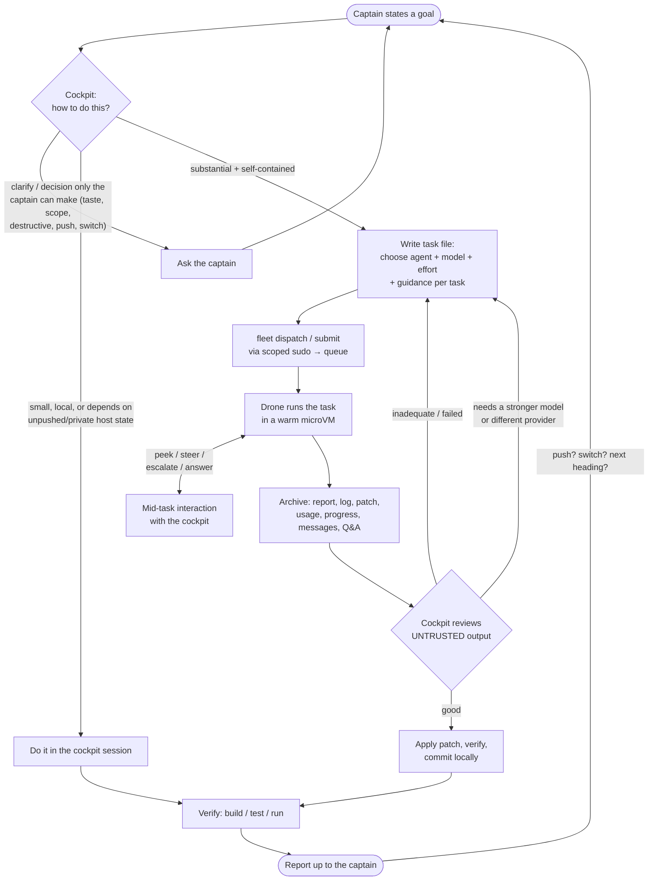

# monix — technical manual

A single-repo, modular NixOS configuration built on the **Dendritic Pattern**
(flake-parts with `*.mod.nix` auto-discovery). It is Linux-only and designed so
that adding a host is a few lines.

Hosts: **fw3** (Framework 13 AMD 7040 running a Hyprland desktop shelled by
DankMaterialShell) and **fw0** (Framework Desktop, Ryzen AI Max+ 395, 128GB —
headless always-on AI server: the agent-fleet microVM host, the user's
persistent cockpit session, Tailscale, and local inference).

## How it fits together

`flake.nix` imports every `*.mod.nix` file in the tree (via
`listFilesRecursive`), so modules are never listed centrally. Each module
registers *aspects* into one of two collections:

- `nixosModules` — NixOS aspects (base system, ssh, hyprland, tailscale, the
  AI services, ...). All are imported into every host but most are inert until
  enabled.
- `homeModules` — Home Manager aspects applied to the primary user.

Packages follow one convention: a tool that carries configuration gets its own
concern file with package and settings together (`modules/cli/git.mod.nix`,
`modules/cli/ghostty.mod.nix`); config-less tools are grouped in
`modules/packages.mod.nix` as functional bundles; Nix-workflow tools sit with the
Nix concern in `modules/core/nix.mod.nix`. There is no separate `home/` directory —
a concern file registers its Home Manager aspect directly, and may also register a
NixOS aspect (as `desktop/hyprland.mod.nix` does for the compositor and the
session).

The folders under `modules/` are namespacing only (discovery is by the
`.mod.nix` suffix, not location): `core/` is the every-host base layer,
`cli/` terminal tools, `desktop/` the graphical session, `networking/` and
`server/` what their names say. `packages.mod.nix` sits at the root because
its bundles span categories.

A host (`hosts/<name>/<name>.mod.nix`) defines its NixOS configuration
directly, imports the aspect collection, and composes explicit local modules
for machine hardware and service selection:

```nix
flake.nixosConfigurations.<name> = lib.nixosSystem {
  modules = [{
    imports = attrValues self.nixosModules;

    networking.hostName = "<name>";
    primaryUser = "<user>";
    isDesktop = true;         # or false for a server
    system.stateVersion = "26.05";
  }];
};
```

There is no generated `hardware-configuration.nix`: local host modules carry
the few per-machine hardware facts and the disko layout, which both generates
the mount config and can format a blank disk to match.

### Desktop vs server

The single switch is `isDesktop` (default `false` ⇒ server). Desktop aspects
(Hyprland, audio, fonts, NetworkManager, the user's graphical session) gate on
it with `mkIf config.isDesktop`, so a server simply omits them by leaving the
flag false. Service aspects (LiteLLM, Open WebUI, Tailscale) gate on their own
`enable` options, which each host may turn on.

## Adding a host

1. `mkdir hosts/<name>` and create `hosts/<name>/<name>.mod.nix` (copy fw3 or
   fw0). Set `primaryUser`, `isDesktop`, `nixpkgs.hostPlatform`, and
   `system.stateVersion`.
2. Set the hardware facts and disko layout in the host module (crib the
   kernel-module list from `nixos-generate-config --show-hardware-config` on
   the machine; point `disko.devices.disk.main.device` at the disk's
   `/dev/disk/by-id/...` path).
3. Add the host's SSH host public key to `keys.nix` under `hosts.<name>`.
4. Add the host's secret rules to `secrets.nix` and create the secrets.
5. Build: `nixos-rebuild switch --flake .#<name>`.

No other file needs editing — auto-discovery and the aspect collections handle
the rest.

## Secrets (agenix)

agenix manages login password hashes, fw0's fleet subscription credentials,
optional provider keys, and Cloudflare Tunnel tokens. Disabled LiteLLM/Open
WebUI secret files remain placeholders and must be replaced with real age
ciphertext before those services are enabled.

`opencode-web-env.age` is retained for an optional app-local password layer.
The current deployment deliberately uses Cloudflare Access as its sole web gate;
set `cockpit.webEnvFile` before relying on that encrypted environment file.

`keys.nix` is the single source of truth for SSH public keys (host keys + admin
keys). `secrets.nix` maps each secret file to the keys it is encrypted to and is
read by the `agenix` CLI. Secrets are decrypted on the host using its SSH host
key (`/etc/ssh/ssh_host_ed25519_key`).

**Bootstrap (per host):**

1. On the target machine, ensure host keys exist: `ssh-keygen -A`.
2. Copy its public key into `keys.nix`:
   `cat /etc/ssh/ssh_host_ed25519_key.pub`.
3. Put your personal public key in `keys.nix` under `admin`.
4. Create the needed secrets (an entry must already exist in `secrets.nix`):

   ```sh
    agenix -e hosts/fw0/secrets/agent-claude-token.age
    agenix -e hosts/fw0/secrets/agent-codex-auth.age
    agenix -e hosts/fw0/secrets/opencode-web-cloudflare-tunnel-token.age
   ```

`hosts/fw0/secrets/tailscale.age` retains the original one-line enrollment key.
The enrolled fw0 node does not consume it during normal activation.

> Both hosts use immutable users with encrypted password hashes. Provision the
> host's password secret before activation; changing a password means replacing
> that hash and switching the host configuration.

## The agent fleet on fw0

fw0 hosts an eight-worker warm pool of disposable microVMs in which Claude Code,
Codex, or opencode runs one fully-permissioned task. Workers are contained by
KVM, a host-only isolated bridge, no gateway/DNS, a default-deny squid egress
proxy, executor-specific Unix credentials, bounded host-file exchange, and
fleet-wide resource limits. Each guest boots a sealed read-only erofs image of
its own closure rather than sharing the host's live store, so host store
maintenance (gc/optimise) cannot touch a running worker. They have no forge
access: the cockpit supplies a source capsule and receives a report plus patch.
The primary cockpit is available through tmux/SSH and at `ai.su.is` through
Cloudflare Access. See [agent-fleet.md](agent-fleet.md) for mechanics and trust
boundaries.

How a task moves through the system, end to end:


<details><summary>Diagram source (Mermaid)</summary>



</details>

The full decision tree — dispatch routing, the worker VM lifecycle with all
failure paths, every mid-task interaction (live peek, steering, cockpit
escalation), and the results flow — is in
[fleet-flow.md](fleet-flow.md).

## Optional AI services

The repository contains reusable LiteLLM and Open WebUI modules, but fw0 does
not currently enable either service. Their encrypted environment files are
retained for a possible future deployment. A host enabling them must supply the
LiteLLM model list and both services' environment files; the modules only set
safe binding, firewall, telemetry, and backend defaults. The active AI services
on fw0 are the local inference endpoint, the agent fleet, and the OpenCode web
cockpit described above.

## Building

```sh
nix flake check                          # evaluate everything
nixos-rebuild switch --flake .#fw3       # or .#fw0
```

First install of a host, from any NixOS installer ISO (formats the disk
declared in the host's disko layout — destructive, check the device path):

```sh
sudo nix run github:nix-community/disko -- --mode disko --flake .#<host>
sudo nixos-install --flake .#<host>
```

## Design choices (deliberate)

- **Linux-only** — no darwin/macOS support.
- **`isDesktop` flag** with `mkIf` gating rather than per-host aspect menus —
  every aspect is imported everywhere and gates itself.
- **Home Manager** for the user session (best Hyprland support), organised as
  `homeModules` aspects.
- **No hardware-configuration.nix / nixos-facter** — per-host hardware facts
  live directly in the host module; disk layouts are declared with disko.
- **Explicit `secrets.nix` rules** (so `agenix -e` works when first creating a
  secret); agenix identity is the system SSH host key rather than a separate
  key partition.
- **No pipe operators** — see AGENTS.md.

## The desktop (fw3)

- **Hyprland config is written in Lua** (`configType = "lua"`), not hyprlang.
  Hyprland deprecated hyprlang at 0.55 (nixpkgs currently ships 0.55.4) in
  favor of Lua, with hyprlang stated to be dropped "1-2 releases" after 0.55.
  Binds are built with a small `mkBind`/`mkEnv` helper in
  `modules/desktop/hyprland.mod.nix`; each bind carries a `description`,
  read back at runtime via `hyprctl binds -j` to power the DMS keybinds
  overlay (SUPER+K) — a `.lua` config is executed, not parseable, so the
  live bind list is the only reliable source.
- **Hyprland is pulled from nixpkgs**, not a git flake input. The session is
  managed by UWSM (greetd → `uwsm start` → Hyprland; see the session-entry
  comment in `hyprland.mod.nix`).
- The desktop shell is **DankMaterialShell** (DMS): the bar, notifications,
  app launcher (spotlight), OSD, control center, lock screen with idle
  handling, wallpaper manager, clipboard history UI, and polkit agent all
  come from it (`modules/desktop/dank.mod.nix`, `programs.dms-shell` from
  nixpkgs; the `dank-material-shell` flake input supplies the greetd greeter
  and a newer shell build — see the comments there).
- **Theming:** DMS's dynamic (wallpaper-synced) theming is enabled for
  GTK/Qt apps via matugen + adw-gtk3 + qt5ct/qt6ct; other apps (ghostty,
  btop, Hyprland borders) use their default themes. CaskaydiaMono Nerd Font
  is the desktop's default monospace font.
